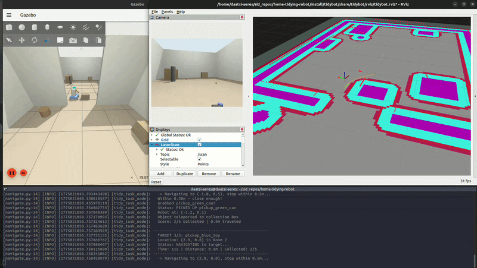

# TidyBot — Home-Tidying Robot Simulation

[](https://youtu.be/L3voKXgXxlE)

## Demo Video

https://youtu.be/L3voKXgXxlE

A ROS 2 simulation of a home-tidying robot that navigates a two-room home, collects 5 scattered objects, and returns them to a collection box.

## System Requirements

| Component | Version |
|-----------|---------|
| OS | Ubuntu 22.04 |
| ROS 2 | Humble Hawksbill |
| Gazebo | Fortress (ign-gazebo6) |
| Build | colcon |

## Dependencies

```bash
# ROS 2 Humble (follow https://docs.ros.org/en/humble/Installation.html)

# Required packages
sudo apt install -y \
  ros-humble-ros-gz-sim \
  ros-humble-ros-gz-bridge \
  ros-humble-ros-gz-image \
  ros-humble-xacro \
  ros-humble-robot-state-publisher \
  ros-humble-nav2-bringup \
  ros-humble-nav2-bt-navigator \
  ros-humble-nav2-map-server \
  ros-humble-nav2-controller \
  ros-humble-nav2-planner \
  ros-humble-nav2-behaviors \
  ros-humble-nav2-lifecycle-manager \
  ros-humble-teleop-twist-keyboard

# xterm (for debug teleop window)
sudo apt install -y xterm
```

## Build

```bash
cd ~/home-tidying-robot
source /opt/ros/humble/setup.bash
colcon build --packages-select tidybot
```

## Launch

```bash
./run.sh
```

This single command starts:
- **Gazebo** — the two-room home with the robot
- **RViz** — pre-configured with laser scan, costmap, planned path, and camera
- **Nav2** — autonomous navigation stack

The terminal shows a boot sequence, then waits for you:
```
  [1/6] Gazebo world loaded
  [2/6] Robot spawned at (-2.0, 0.0)
  [3/6] Sensor bridge active (LiDAR, camera, IMU)
  [4/6] Ground truth localization locked
  [5/6] Static map loaded (260x140 @ 0.05m)
  [6/6] Nav2 stack ready!
  All systems online.

  ALL SYSTEMS READY
  Press Enter in this terminal to start the tidying mission.

>>> Press Enter to start the tidying mission...
```

Press **Enter** to begin. The robot sweeps both rooms, collects all 5 objects:
```
  TARGET 1/5: pickup_red_block
  Location: (-1.5, -0.3) in Room 1
  Status: PICKED UP pickup_red_block
  Score: 1/5 collected | 0.5m traveled
  ...
  TIDYBOT MISSION REPORT
  Time:       120s (2.0 min)
  Distance:   14.9m
  Collected:  5/5 objects
```

## Debug Mode

For manual driving and sensor verification (no autonomous navigation):

```bash
./run_debug.sh
```

This opens:
- **Gazebo** — the home world with the robot
- **RViz** — laser scan, static map, costmap, TF frames, camera
- **xterm window** — keyboard teleop

Drive with `i/j/k/l` keys (click the xterm window first). `z/x` to change speed, `k` to stop. The laser scan should stay aligned with the static map at all times — this verifies the localization and TF chain are working correctly.

## What Happens

1. Gazebo launches with the two-room home world
2. TidyBot spawns in Room 1 near the collection box
3. Localization and TF chain initialize
4. Nav2 plans paths using the pre-built map
5. The robot sweeps Room 1 (3 objects) → doorway → Room 2 (2 objects)
6. Each object is picked up (arm animation + teleport to box)
7. Robot returns to the collection box for final release

## ROS Topics

| Topic | Type | Direction | Description |
|-------|------|-----------|-------------|
| `/cmd_vel` | `geometry_msgs/Twist` | ROS → GZ | Drive commands |
| `/odom` | `nav_msgs/Odometry` | GZ → ROS | Wheel odometry (velocity only) |
| `/scan` | `sensor_msgs/LaserScan` | GZ → ROS | 360-degree LiDAR |
| `/camera/image_raw` | `sensor_msgs/Image` | GZ → ROS | Forward-facing camera |
| `/imu` | `sensor_msgs/Imu` | GZ → ROS | IMU (orientation + angular velocity) |

## Robot Spec

- 4-wheeled skid-steer base (0.50m x 0.40m)
- Vertical torso with face panel (LED display)
- Right arm: 3-DOF (shoulder, elbow, wrist) + end-effector
- Left arm: cosmetic (fixed pose)
- Camera: 640x480 RGB at 15fps on torso
- LiDAR: 360-sample, 8m range at 10Hz on base
- IMU: 50Hz on base

## Project Structure

```
home-tidying-robot/
├── run.sh                              # One-command launch (autonomous)
├── run_debug.sh                        # Debug mode (manual teleop)
├── generate_map.py                     # Map generation utility
├── requirements.txt                    # System dependencies
├── docs/
│   └── APPROACH.md                     # Design choices & architecture
└── src/tidybot/
    ├── urdf/tidybot.urdf.xacro        # Robot model (URDF + Gazebo plugins)
    ├── worlds/home.sdf                 # Two-room home environment
    ├── config/nav2_params.yaml         # Nav2 planner/controller parameters
    ├── maps/home_map.{yaml,pgm}        # Pre-built occupancy grid
    ├── rviz/tidybot.rviz              # RViz display configuration
    ├── launch/
    │   ├── simulation.launch.py        # Full simulation launch
    │   └── debug.launch.py             # Debug/teleop launch
    └── scripts/
        ├── navigate.py                 # Autonomous sweep-and-collect task
        └── ground_truth_tf.py          # Localization TF publisher
```

